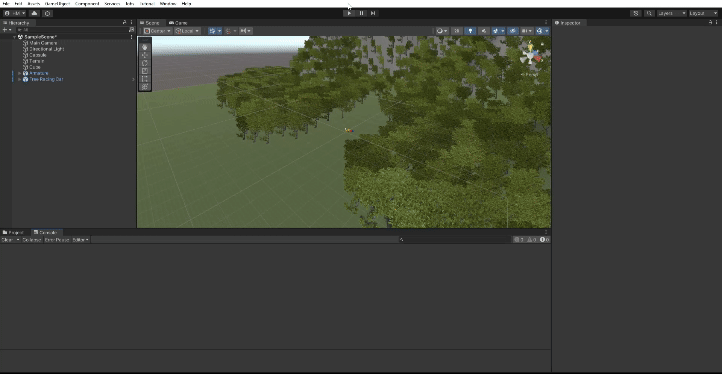
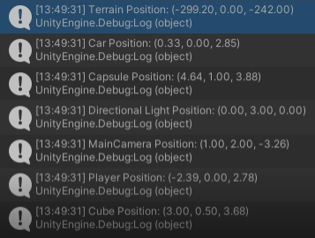

# Interfaces Inteligentes

- Hugo Hernández Martín (alu0101481227@ull.edu.es)

## Práctica 1: Introducción a Unity

En la presente práctica se han introducido los conceptos básicos sobre el motor de creación de videojuegos y experiencias interactivas *Unity*.

En primer lugar, se ha procedido a **incluir diferentes objetos 3D**, algunos de ellos básicos, como un **cubo** o una **cápsula** y otros provenientes de paquetes de la Asset Store, como pueden ser un **coche** (paquete no perteneciente a los Starter Assets) o un **robot** (perteneciente al Starter Asset: Third Person).

Además, se ha incluido un **terreno** al que se ha dotado de diferentes montañas, se le han añadido varias capas de textura (una base de piedra y otra con césped) y se han colocado algunos árboles (incluyendo al proyecto otro paquete obtenido en la Asset Store) alrededor de la escena.

Es destacable que a cada elemento se le ha colocado una **etiqueta** (tag) que lo identifique.

Por último, se ha escrito un Script que se encarga de mostrar por consola la posición de un objeto (GameObject). Éste ha sido incluido como componente en todos los objetos (GameObjects). Es importante destacar que en este Script se ha hecho uso del componente ***Transform*** (presente en todos los GameObjects) y se ha colocado la impresión por consola de la posición en la sección de ***Start*** del Script ya que, de esta forma, se muestra una única vez por cada objeto (antes del primer frame del objeto). En caso de que los objetos se movieran sería conveniente desplazar el código a la sección ***Update***, para que las posiciones mostradas cambien según el objeto se desplaza.

A continuación se observa un GIF animado mostrando el comportamiento del Script:

Además, se añade una foto en detalle de las posiciones mostradas por el Script:

